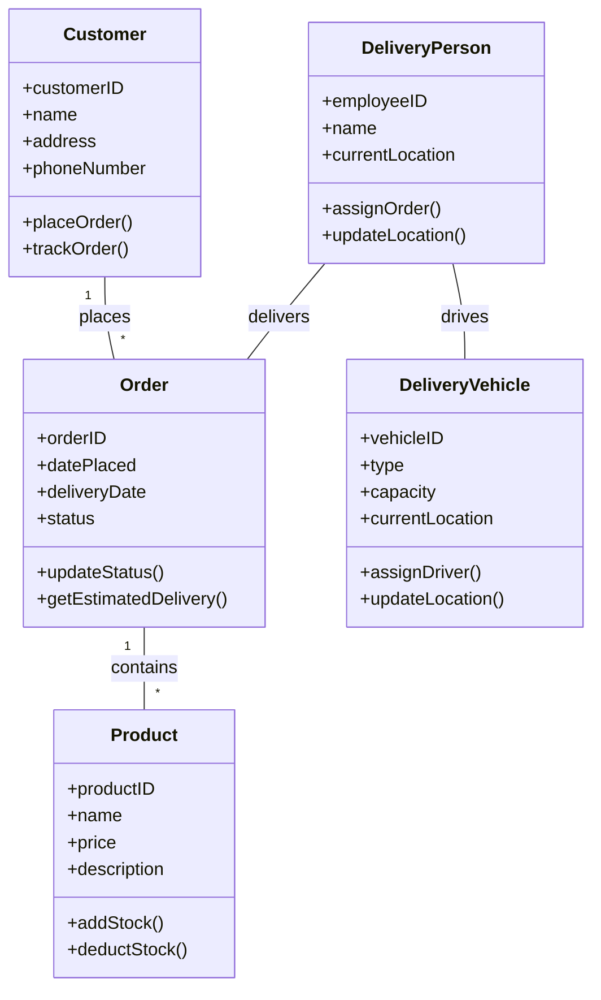

# 2주차 과제

### 1. github 공개 레포지토리를 만들고 URL을 공개하십시오.
https://github.com/jinmouse/ChatGPT.git
<br>

### 2. 개발자용 프롬프트 3가지 이상을 작성하시오 ( 그 중 한가지는 UML 과제 )
#### 2-1. UML - Mermaid Flow Chart
**Prompt**  
나는 지금 배송시스템 UML을 만들고 싶어. 예시 구조를 만들고 네가 제시한 내용을 Mermaid Flow Chart를 통해 UML로 만들어줘
(==============>>> detatils 태그안에 class 다이어그램을 작성하면 에러가 납니다. details 태그 밖에서 작성하면 다이어그램이 표시가 됩니다.)

<details>
<summary>Answer</summary>

먼저, 간단한 배송 시스템의 UML을 설계해볼게요. 여기에는 주요한 클래스와 그들 간의 관계를 포함하겠습니다. 다음은 예시 구조입니다:

1. **Customer**:
    - Attributes: `customerID`, `name`, `address`, `phoneNumber`
    - Operations: `placeOrder()`, `trackOrder()`

2. **Order**:
    - Attributes: `orderID`, `datePlaced`, `deliveryDate`, `status`
    - Operations: `updateStatus()`, `getEstimatedDelivery()`

3. **Product**:
    - Attributes: `productID`, `name`, `price`, `description`
    - Operations: `addStock()`, `deductStock()`

4. **DeliveryPerson**:
    - Attributes: `employeeID`, `name`, `currentLocation`
    - Operations: `assignOrder()`, `updateLocation()`

5. **DeliveryVehicle**:
    - Attributes: `vehicleID`, `type`, `capacity`, `currentLocation`
    - Operations: `assignDriver()`, `updateLocation()`

**관계**:
- `Customer`는 여러 개의 `Order`를 가질 수 있습니다.
- 각 `Order`는 여러 개의 `Product`를 가질 수 있습니다.
- `Order`는 하나의 `DeliveryPerson`에 할당될 수 있습니다.
- `DeliveryPerson`은 하나의 `DeliveryVehicle`를 운전할 수 있습니다.

이제 이 구조를 Mermaid flowchart를 통해 표현해봅니다:



```
classDiagram
    Customer "1" -- "*" Order : places
    Order "1" -- "*" Product : contains
    DeliveryPerson -- Order : delivers
    DeliveryPerson -- DeliveryVehicle : drives

    class Customer {
        +customerID
        +name
        +address
        +phoneNumber
        +placeOrder()
        +trackOrder()
    }

    class Order {
        +orderID
        +datePlaced
        +deliveryDate
        +status
        +updateStatus()
        +getEstimatedDelivery()
    }

    class Product {
        +productID
        +name
        +price
        +description
        +addStock()
        +deductStock()
    }

    class DeliveryPerson {
        +employeeID
        +name
        +currentLocation
        +assignOrder()
        +updateLocation()
    }

    class DeliveryVehicle {
        +vehicleID
        +type
        +capacity
        +currentLocation
        +assignDriver()
        +updateLocation()
    }
```

이 플로우 차트를 Mermaid가 지원하는 도구나 플러그인에 입력하면 시각적인 UML 다이어그램이 생성됩니다. 필요에 따라 수정하거나 확장할 수 있습니다.

</details>

