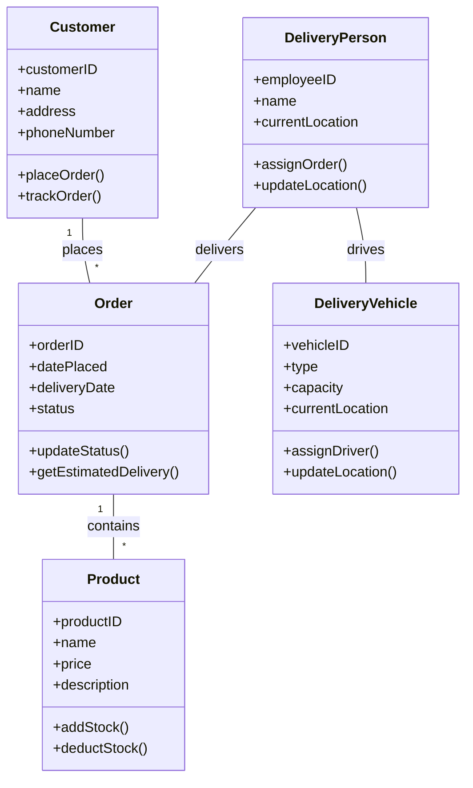

### 1. github 공개 레포지토리를 만들고 URL을 공개하십시오.
https://github.com/jinmouse/ChatGPT.git
<br>

### 2. 개발자용 프롬프트 3가지 이상을 작성하시오 ( 그 중 한가지는 UML 과제 )
#### 2-1. UML - Mermaid Flow Chart
**Prompt**  
나는 지금 배송시스템 UML을 만들고 싶어. 예시 구조를 만들고 네가 제시한 내용을 Mermaid Flow Chart를 통해 UML로 만들어줘
(==============>>> detatils 태그안에 class 다이어그램을 작성하면 에러가 납니다. 그래서 details 태그 밖에서 작성하였습니다.)


<details>
<summary>2-1의 Answer</summary>

먼저, 간단한 배송 시스템의 UML을 설계해볼게요. 여기에는 주요한 클래스와 그들 간의 관계를 포함하겠습니다. 다음은 예시 구조입니다:

1. **Customer**:
    - Attributes: `customerID`, `name`, `address`, `phoneNumber`
    - Operations: `placeOrder()`, `trackOrder()`

2. **Order**:
    - Attributes: `orderID`, `datePlaced`, `deliveryDate`, `status`
    - Operations: `updateStatus()`, `getEstimatedDelivery()`

3. **Product**:
    - Attributes: `productID`, `name`, `price`, `description`
    - Operations: `addStock()`, `deductStock()`

4. **DeliveryPerson**:
    - Attributes: `employeeID`, `name`, `currentLocation`
    - Operations: `assignOrder()`, `updateLocation()`

5. **DeliveryVehicle**:
    - Attributes: `vehicleID`, `type`, `capacity`, `currentLocation`
    - Operations: `assignDriver()`, `updateLocation()`

**관계**:
- `Customer`는 여러 개의 `Order`를 가질 수 있습니다.
- 각 `Order`는 여러 개의 `Product`를 가질 수 있습니다.
- `Order`는 하나의 `DeliveryPerson`에 할당될 수 있습니다.
- `DeliveryPerson`은 하나의 `DeliveryVehicle`를 운전할 수 있습니다.

이제 이 구조를 Mermaid flowchart를 통해 표현해봅니다:

```
classDiagram
    Customer "1" -- "*" Order : places
    Order "1" -- "*" Product : contains
    DeliveryPerson -- Order : delivers
    DeliveryPerson -- DeliveryVehicle : drives

    class Customer {
        +customerID
        +name
        +address
        +phoneNumber
        +placeOrder()
        +trackOrder()
    }

    class Order {
        +orderID
        +datePlaced
        +deliveryDate
        +status
        +updateStatus()
        +getEstimatedDelivery()
    }

    class Product {
        +productID
        +name
        +price
        +description
        +addStock()
        +deductStock()
    }

    class DeliveryPerson {
        +employeeID
        +name
        +currentLocation
        +assignOrder()
        +updateLocation()
    }

    class DeliveryVehicle {
        +vehicleID
        +type
        +capacity
        +currentLocation
        +assignDriver()
        +updateLocation()
    }
```

이 플로우 차트를 Mermaid가 지원하는 도구나 플러그인에 입력하면 시각적인 UML 다이어그램이 생성됩니다. 필요에 따라 수정하거나 확장할 수 있습니다.

</details>

#### 2-2. Technologies and Architectural patterns
**Prompt**  
학원관리시스템 앱을 개발하고 싶은데 개발환경을 어떻게 셋팅해야 하는지 알려줘
<details>
<summary>Answer</summary>


학원 관리 시스템 앱을 개발하기 위한 개발 환경을 설정하는 단계를 아래에 소개합니다. 여기서는 웹 기반 애플리케이션으로 가정하며, 프론트엔드와 백엔드를 모두 고려합니다:

### 1. 프로젝트 목표 및 요구사항 정의:
- 학원의 교육생 관리, 강사 관리, 수업 관리, 결제 관리 등의 기능을 정의합니다.
- 학원의 실제 운영 과정을 이해하고, 어떤 기능이 필요한지 정확히 파악합니다.

### 2. 프론트엔드 (Front-end):

#### 2.1. 개발 환경 설정:
- **노드(Node.js)**: 프론트엔드 라이브러리나 프레임워크를 사용하려면 Node.js가 필요합니다.
  - 설치: [Node.js 공식 사이트](https://nodejs.org/)
- **패키지 매니저(npm/yarn)**: 라이브러리 및 의존성 관리
  - 설치: Node.js 설치 시 npm 자동 포함, yarn은 별도로 [Yarn 공식 사이트](https://yarnpkg.com/)에서 설치

#### 2.2. 프레임워크/라이브러리 선택:
- **React, Vue.js, Angular** 중 하나를 선택. 여기서는 예시로 React를 사용하겠습니다.
  - React 초기화: `npx create-react-app 학원관리시스템-앱이름`

#### 2.3. 스타일링:
- **CSS 프레임워크**: Bootstrap, Tailwind CSS, Materialize 등 중 하나 선택하여 설치.
  
### 3. 백엔드 (Back-end):

#### 3.1. 개발 환경 설정:
- **언어 선택**: Java (Spring Boot), Python (Django, Flask), Node.js (Express.js) 등 중 선택.
  - 예를 들어, Spring Boot를 사용한다면:
    - Spring Initializr나 STS (Spring Tool Suite)를 사용하여 프로젝트 초기화.

#### 3.2. 데이터베이스 설정:
- **데이터베이스 선택**: MySQL, PostgreSQL, MongoDB 등.
  - 예를 들어, MySQL을 사용한다면:
    - MySQL 설치 및 설정.
    - JDBC 드라이버를 백엔드 프로젝트에 추가.

#### 3.3. API 설계:
- RESTful API 혹은 GraphQL을 기반으로 API를 설계하고 구현합니다.

### 4. 협업 도구 및 추가 설정:

- **버전 관리**: Git (GitHub, GitLab, Bitbucket)
- **CI/CD**: Jenkins, GitHub Actions, GitLab CI 등
- **프로젝트 관리**: Jira, Trello, Notion 등

### 5. 배포:

- **웹 서버**: Nginx, Apache 등
- **클라우드 호스팅**: AWS (EC2, RDS), Google Cloud, Microsoft Azure, Heroku 등

---

이러한 개발 환경 설정 후, 실제 개발을 시작하기 전에 프로젝트의 스펙, 요구사항, 디자인, 사용자 플로우 등을 자세히 계획하는 것이 중요합니다. 학원 관리 시스템의 복잡성과 세부 요구사항에 따라 추가적인 툴이나 기술 선택이 필요할 수 있습니다.
</details>

#### 2-3. 정규식 코드 생성
**Prompt**  
주민번호 유효성 체크를 하는 정규식 코드를 java로 만들어줘

<details>
<summary>Answer</summary>

주민등록번호의 유효성을 체크하는 작업은 두 단계로 이루어질 수 있습니다.

1. 형식의 유효성 체크: 정규식을 사용하여 주민등록번호가 올바른 형식인지 체크합니다.
2. 주민등록번호 알고리즘에 따른 유효성 체크: 주민등록번호의 각 자리수를 활용하여 알고리즘을 만족하는지 체크합니다.

아래는 Java로 주민등록번호의 유효성을 체크하는 코드입니다:

```java
import java.util.regex.Matcher;
import java.util.regex.Pattern;

public class ResidentRegistrationNumberValidator {

    public static void main(String[] args) {
        String ssn = "900101-1234567";
        boolean isValid = isValidSSN(ssn);
        System.out.println("Is valid? " + isValid);
    }

    public static boolean isValidSSN(String ssn) {
        // 1. 형식의 유효성 체크
        Pattern pattern = Pattern.compile("^(\\d{6})-?(\\d{7})$");
        Matcher matcher = pattern.matcher(ssn);
        if (!matcher.matches()) {
            return false;
        }

        int[] weights = {2, 3, 4, 5, 6, 7, 8, 9, 2, 3, 4, 5};
        int sum = 0;

        // 2. 주민등록번호 알고리즘에 따른 유효성 체크
        for (int i = 0; i < 12; i++) {
            sum += (ssn.charAt(i) - '0') * weights[i];
        }

        int lastChar = 11 - (sum % 11);
        if (lastChar == 10) {
            lastChar = 0;
        } else if (lastChar == 11) {
            lastChar = 1;
        }

        return lastChar == (ssn.charAt(12) - '0');
    }
}
```

위의 코드는 주민등록번호의 형식과 알고리즘을 모두 만족하는지를 체크합니다. 주의할 점은 위의 코드는 유효성만 체크하므로 실제로 해당 주민등록번호가 존재하는지, 그리고 해당 정보가 사실인지 등은 따로 확인해야 합니다.
</details>

<br>

### 3. ADA 프롬프트 3가지 이상을 작성하시오.
#### 3-1. 수치계산
**Prompt**  
대한민국 서울에서 유럽 영국까지 육지로 이동한다면 시간이 얼마가 걸리는지 알려줘
```
(Tell me how long it takes to travel from Seoul, South Korea to Europe and the U.K. by land)
```
<details>
<summary>Answer</summary>

서울, 대한민국에서 영국 런던까지 육로로 여행하는 시간에 대한 설명입니다:

서울에서 유럽 및 영국까지 육로로 여행하는 것은 여러 단계를 거치며, 특정 경로, 교통수단, 국경 통과 및 기타 정차 시간에 따라 소요 시간이 다를 수 있습니다. 여기에 잠재적 경로의 대략적인 내용이 있습니다:

1. **서울에서 블라디보스토크(러시아)**까지 기차로:
    - 기차 여행은 대략 22-24시간이 소요됩니다.

2. **블라디보스토크에서 모스크바(러시아)**까지 트랜스시베리아 철도를 이용하여:
    - 이 여정은 기차로 약 6-7일이 걸립니다.

3. **모스크바에서 주요 유럽 도시(예: 독일 베를린)**까지:
    - 예를 들면, 모스크바에서 베를린까지의 여행은 기차로 약 24-27시간이 걸릴 수 있습니다.

4. **베를린(독일)에서 런던(영국)**까지:
    - 기차(채널 터널을 통한 유로스타 포함)로 여행하면 약 10-12시간이 걸립니다.

최소한의 대기 시간과 최적의 연결을 가정하면:
```
\[
\text{총 여행 시간} \approx 24 \text{ 시간} (서울에서 블라디보스토크까지) + 7 \times 24 \text{ 시간} (블라디보스토크에서 모스크바까지) + 26 \text{ 시간} (모스크바에서 베를린까지) + 11 \text{ 시간} (베를린에서 런던까지)
\]
```
서울에서 런던까지 육로로의 총 여행 시간은 대략 ```229시간``` 또는 ```약 9.5일```입니다. 이는 연장된 휴식, 대기 시간, 관광 없이 연속적인 여행 시간입니다. 실제로는 연결 대기, 휴식, 관광 및 국경 통과에서의 잠재적 지연과 같은 다양한 요인으로 인해 여행 시간이 더 길어질 수 있습니다.
</details>

#### 3-2. 엑셀 파일 분석
**Prompt**  
다음 서울시 지하철 혼잡도에 대한 통계자료로 서울지역에서 운행중인(서울메트로, 도시철도공사) 지하철의 혼잡정도 자료를 그래프 자료로 변해줘

사용한 자료:
[국토교통부_표준지공시지가](https://www.data.go.kr/data/15004246/fileData.do)  
<details>
<summary>Answer</summary>


</details>
  
#### 3-3. 수학적 명제를 증명하기 
**Prompt**  
오일러 회로: 모든 정점이 짝수 차수를 가지면, 그래프에는 오일러 회로가 존재한다.  
이 명제를 수학적으로 증명해줘
<details>
<summary>Answer</summary>

오일러의 정리에 따라 그래프에서 모든 정점이 짝수 차수를 가질 때 오일러 회로가 존재한다는 것을 증명할 수 있습니다. 여기에 대한 증명은 다음과 같습니다:
정의: 
+ 그래프에서 정점의 '차수'는 해당 정점에서 나가는 간선의 수입니다.
+ 그래프에서 '오일러 회로'는 그래프의 모든 간선을 정확히 한 번씩만 거쳐 시작점으로 돌아오는 회로입니다.

증명:
+ 모든 정점의 차수가 짝수인 그래프를 가정합시다.
+ 그래프에서 임의의 정점을 시작점으로 선택합니다.
+ 시작점에서 시작하여 아무 간선도 두 번 지나치지 않고 계속 갑니다.
+ 모든 정점의 차수가 짝수이므로, 새로운 정점에 도착할 때마다 항상 나갈 수 있는 다른 간선이 있습니다 (처음의 간선을 제외하면 남은 간선의 수는 항상 홀수이므로 최소 하나 이상의 간선이 있어야 합니다).
+ 이 경로는 반드시 시작점으로 돌아와야 합니다. 왜냐하면 시작점을 제외한 모든 정점에서 들어오는 간선마다 나가는 간선이 있기 때문입니다.
+ 이 경로가 그래프의 모든 간선을 포함하는 경우, 오일러 회로가 완성되고 증명이 종료됩니다.
+ 그렇지 않은 경우, 아직 방문하지 않은 간선이 있는 정점을 찾습니다. 이러한 정점의 차수는 짝수이므로, 이 정점에서 시작하여 새로운 회로를 만들 수 있습니다. 이 회로는 원래의 경로와 결합하여 더 긴 회로를 형성합니다.
+ 모든 간선이 이 회로에 포함될 때까지 7단계를 반복합니다.
+ 결국, 오일러 회로가 형성됩니다.

따라서 모든 정점의 차수가 짝수인 그래프에는 오일러 회로가 존재한다는 것이 증명되었습니다.
</details>

<br>

### 4. ChatGPT 플러그인 프롬프트 3가지 이상을 작성하시오.
#### 4-1. Diagrams: Show Me
**Prompt**  
깃헙으로 협업하는 방법을 다이어그램으로 표현해줘.
<details>
<summary>Answer</summary>
  
깃헙으로 협업하는 방법을 나타내는 다이어그램입니다:  


commit: 초기 커밋을 두 번 수행합니다.
branch develop: 'develop' 브랜치를 생성합니다.
checkout develop: 'develop' 브랜치로 전환합니다.
commit: 'develop' 브랜치에서 커밋을 두 번 수행합니다.
checkout main: 다시 'main' 브랜치로 전환합니다.
merge develop: 'develop' 브랜치의 변경 사항을 'main' 브랜치로 병합합니다.
commit: 'main' 브랜치에서 추가로 커밋을 두 번 수행합니다.

이 다이어그램은 기본적인 깃헙의 브랜치 전략을 보여줍니다. 'develop' 브랜치에서 작업을 수행한 후, 그 작업을 'main' 브랜치로 병합하는 과정을 나타냅니다.
</details>

#### 4-2. Smart Slides
**Prompt**  
색상 #FF5A5F을 사용하여 집을 대여할 수 있는 비즈니스에 대한 피치 덱을 만들어줘.
<details>
<summary>Answer</summary>
  
집을 대여할 수 있는 비즈니스에 대한 피치 덱를 다운로드 받으실 수 있습니다.
피드백을 통해 제품을 개선하는 데 도움을 주시면 감사하겠습니다. 여기에서 설문조사에 참여해주실 수 있습니다.
슬라이드가 만족스러우신가요? 추가적인 요청이나 수정 사항이 있으시면 알려주세요!

[ee6a60b9-4d99-4f6e-a91c-749a6563871d.pptx](https://github.com/Ilpyo-Yang/study-chatgpt-chatbot/files/12655232/ee6a60b9-4d99-4f6e-a91c-749a6563871d.pptx)
</details>

#### 4-3. Expedia
**Prompt**  
10월 일본여행 3박 4일 일정을 위한 항공, 숙소를 추천해서 계획을 만들어줘
<details>
<summary>Answer</summary>

물론이죠! 10월에 일본 여행을 계획하시는군요. 멋진 선택입니다! 😊  

먼저, 숙소를 추천해 드리겠습니다.  
여행하실 도시나 지역을 알려주실 수 있나요? (예: 도쿄, 오사카, 교토 등)  
항공편을 위해 출발하실 도시나 공항 이름을 알려주시면 감사하겠습니다.  
이 정보를 토대로 최적의 추천을 드리겠습니다!  

```
오사카 여행이고 인천 출발로 계획해줘
```

먼저, 오사카 현 내의 오사카 및 주변 지역에 대한 숙소 추천을 드리겠습니다!

1. Hotel Nikko Osaka
+ 위치: Shinsaibashi 지역, Dotonbori Glico Sign 및 Hozenji-Yokocho Alley에서 15분 거리. Shinsaibashi Station은 도보로 2분, Yotsubashi Station은 5분 거리에 있습니다.
+ 설명: 5개의 레스토랑, 바/라운지, 커피숍 등이 있으며, 공용 지역에서 무료 Wi-Fi를 이용하실 수 있습니다.
+ 별점: 4.0
+ 고객 평점: 9.2 / 10.0 (리뷰 2199개)
+ 가격: 일 평균 $141.09 (프로모션: 15% 할인)
+ 예약하기

2. Centara Grand Hotel Osaka
+ 위치: Namba 지역, Nipponbashi, Hozenji-Yokocho Alley, Dotonbori Glico Sign에서 15분 거리. Namba Station (Nankai)은 도보로 6분, Imaimiyaebisu Station은 10분 거리에 있습니다.
+ 설명: 5개의 레스토랑, 2개의 바/라운지, 풀 서비스 스파 등이 있으며, 공용 지역에서 무료 Wi-Fi를 이용하실 수 있습니다.
+ 별점: 4.5
+ 고객 평점: 9.0 / 10.0 (리뷰 39개)
+ 가격: 일 평균 $216.16 (특별 프로모션)
+ 예약하기
  
3. APA HOTEL＆RESORT〈OSAKA UMEDA EKI TOWER〉
+ 위치: Kita 지역, HEP Five Shopping Mall, Grand Front Osaka Mall, Umeda Sky Building에서 2마일 이내. Umeda Station (Hanshin)은 도보로 8분, Nishi-Umieda Station은 9분 거리에 있습니다.
+ 설명: 2개의 레스토랑, 커피숍 등이 있으며, 공용 지역에서 무료 Wi-Fi를 이용하실 수 있습니다.
+ 별점: 3.0
+ 고객 평점: 8.6 / 10.0 (리뷰 457개)
+ 가격: 일 평균 $79.93 (프로모션: 10% 할인)
+ 예약하기
  
이 중에서 어떤 숙소가 마음에 드시나요? 또한, 다음으로 항공편 추천을 진행하겠습니다. 원하시는 항공편의 특별한 조건이나 선호사항이 있으시면 알려주세요! 😊
</details>
