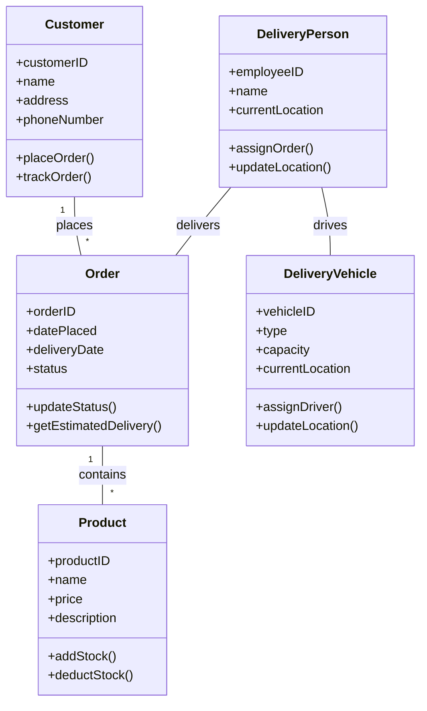

```mermaid
classDiagram
    Customer "1" -- "*" Order : places
    Order "1" -- "*" Product : contains
    DeliveryPerson -- Order : delivers
    DeliveryPerson -- DeliveryVehicle : drives

    class Customer {
        +customerID
        +name
        +address
        +phoneNumber
        +placeOrder()
        +trackOrder()
    }

    class Order {
        +orderID
        +datePlaced
        +deliveryDate
        +status
        +updateStatus()
        +getEstimatedDelivery()
    }

    class Product {
        +productID
        +name
        +price
        +description
        +addStock()
        +deductStock()
    }

    class DeliveryPerson {
        +employeeID
        +name
        +currentLocation
        +assignOrder()
        +updateLocation()
    }

    class DeliveryVehicle {
        +vehicleID
        +type
        +capacity
        +currentLocation
        +assignDriver()
        +updateLocation()
    }

```
