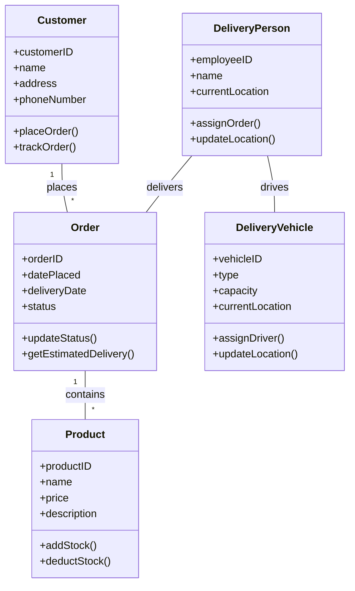

# 2주차 과제

### 1. github 공개 레포지토리를 만들고 URL을 공개하십시오.
https://github.com/jinmouse/ChatGPT.git
<br>

### 2. 개발자용 프롬프트 3가지 이상을 작성하시오 ( 그 중 한가지는 UML 과제 )
#### 2-1. UML - Mermaid Flow Chart
**Prompt**  
나는 지금 배송시스템 UML을 만들고 싶어. 예시 구조를 만들고 네가 제시한 내용을 Mermaid Flow Chart를 통해 UML로 만들어줘

<details>
<summary>Answer</summary>

```
```

</details>
