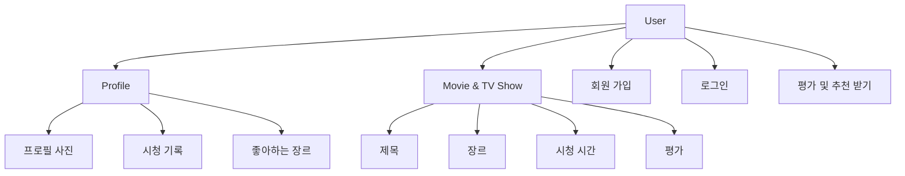

# 2주차 과제

### 1. github 공개 레포지토리를 만들고 URL을 공개하십시오.
https://github.com/Ilpyo-Yang/study-chatgpt-chatbot.git

<br>

### 2. 개발자용 프롬프트 3가지 이상을 작성하시오 ( 그 중 한가지는 UML 과제 )
#### 2-1. UML - Mermaid Flow Chart
**Prompt**  
나는 지금 넷플릭스 UML을 만들고 싶어. 예시 구조를 만들고 네가 제시한 내용을 Mermaid Flow Chart를 통해 UML로 만들어줘
<details>
<summary>Answer</summary>

넷플릭스의 주요 기능과 구조를 간략하게 나타내는 UML 예시와 이를 Mermaid를 사용하여 표현하는 방법을 안내하겠습니다.

먼저, 넷플릭스의 주요 구조와 기능을 고려하여 예시를 제시합니다:

User:

회원 가입
로그인
프로필 생성/수정
영화 및 TV 프로그램 시청
평가 및 추천 받기
Profile:

프로필 사진
시청 기록
좋아하는 장르
Movie & TV Show:

제목
장르
시청 시간
평가
이러한 구조를 바탕으로 Mermaid Flow Chart로 UML을 표현하면 다음과 같습니다:

```
graph TD
  User[User]
  Profile[Profile]
  MovieTVShow[Movie & TV Show]

  User --> SignUp[회원 가입]
  User --> Login[로그인]
  User --> Profile
  User --> MovieTVShow
  User --> RatingRecommendation[평가 및 추천 받기]
  
  Profile --> ProfilePicture[프로필 사진]
  Profile --> WatchHistory[시청 기록]
  Profile --> FavoriteGenre[좋아하는 장르]
  
  MovieTVShow --> Title[제목]
  MovieTVShow --> Genre[장르]
  MovieTVShow --> WatchTime[시청 시간]
  MovieTVShow --> Evaluate[평가]
```

위의 코드를 Mermaid를 지원하는 마크다운 편집기나 렌더러에서 렌더링하면 넷플릭스의 간략한 UML을 볼 수 있습니다.  
참고로, 이 UML은 간략하게 넷플릭스의 주요 기능과 구조를 나타낸 예시이므로 실제 넷플릭스의 전체 구조와 기능을 반영하지 않을 수 있습니다.
</details>

#### 2-2. Technologies and Architectural patterns
**Prompt**  
당신의 팀은 실시간 채팅 애플리케이션을 개발 중입니다. 애플리케이션이 성능이 좋고 안정적으로 동작하게 하기 위해 어떤 기술과 아키텍처를 고려해야 할까요? 대량의 동시 사용자를 처리하기 위해 애플리케이션의 확장을 어떻게 처리할 건가요?
<details>
<summary>Answer</summary>


실시간 채팅 애플리케이션을 개발할 때 고려해야 할 기술과 아키텍처는 다음과 같습니다:

+ 프로토콜 선택: WebSocket은 실시간 양방향 통신을 위한 표준 프로토콜로, HTTP보다 효율적인 실시간 데이터 전송을 제공합니다.
+ 메시징 브로커: RabbitMQ, Kafka와 같은 메시징 브로커를 사용하여 대량의 메시지를 효과적으로 처리하고 분산 시스템 간의 메시지 전달을 보장합니다.
+ 데이터베이스 선택: 채팅 메시지, 사용자 정보, 채널 정보 등을 저장하기 위한 데이터베이스 선택이 필요합니다. NoSQL 데이터베이스(예: Cassandra, MongoDB)는 확장성과 유연성을 제공합니다.
+ 분산 시스템: 마이크로서비스 아키텍처를 채택하여 각 서비스를 독립적으로 확장 및 유지보수할 수 있게 합니다.
+ 로드 밸런서: 여러 서버 인스턴스에 걸쳐 요청을 분산시키기 위해 로드 밸런서(예: Nginx, HAProxy)를 사용합니다.
+ 스케일링: 수평 스케일링을 통해 시스템의 로드에 따라 서버 인스턴스를 추가하거나 제거함으로써 대량의 동시 사용자를 처리합니다.
+ 장애 회복: 사용자의 세션 정보나 중요 메시지를 분산된 서버나 데이터 센터에 복제하여 한 지점에서의 장애가 전체 시스템에 영향을 미치지 않게 합니다.
+ 캐싱: Redis나 Memcached와 같은 인메모리 데이터 저장소를 사용하여 자주 접근하는 데이터를 빠르게 검색할 수 있게 합니다.
+ 보안: HTTPS, JWT 등의 기술을 사용하여 데이터를 암호화하고 사용자 인증 및 인가를 처리합니다.
+ 모니터링 및 로깅: 시스템의 상태를 실시간으로 모니터링하고 문제 발생 시 적절한 대응을 할 수 있도록 로그를 기록합니다.

이러한 아키텍처와 기술을 통해 실시간 채팅 애플리케이션을 성능 있고 안정적으로 운영하며, 확장성을 갖출 수 있습니다.
</details>

#### 2-3. C to Kotlin
**Prompt**  
다음 c로 작성된 코드를 kotlin으로 변경해줘
```c
static void callReplySetSharedData(CallReply *rep, int type, const char *proto, size_t proto_len, int extra_flags) {
    rep->type = type;
    rep->proto = proto;
    rep->proto_len = proto_len;
    rep->flags |= extra_flags;
}

static void callReplyNull(void *ctx, const char *proto, size_t proto_len) {
    CallReply *rep = ctx;
    callReplySetSharedData(rep, REDISMODULE_REPLY_NULL, proto, proto_len, REPLY_FLAG_RESP3);
}

static void callReplyNullBulkString(void *ctx, const char *proto, size_t proto_len) {
    CallReply *rep = ctx;
    callReplySetSharedData(rep, REDISMODULE_REPLY_NULL, proto, proto_len, 0);
}
```
<details>
<summary>Answer</summary>

C에서 Kotlin으로 변환하면서 일부 내용은 가정해야 할 수 있습니다. Kotlin에서는 특정 타입에 대한 정확한 대응이 C와 다를 수 있으므로, 이를 고려하여 아래와 같이 변환하겠습니다:
```kotlin
data class CallReply(
    var type: Int,
    var proto: String,
    var protoLen: Int,
    var flags: Int
)

fun callReplySetSharedData(rep: CallReply, type: Int, proto: String, protoLen: Int, extraFlags: Int) {
    rep.type = type
    rep.proto = proto
    rep.protoLen = protoLen
    rep.flags = rep.flags or extraFlags
}

fun callReplyNull(ctx: Any, proto: String, protoLen: Int) {
    val rep = ctx as CallReply
    callReplySetSharedData(rep, REDISMODULE_REPLY_NULL, proto, protoLen, REPLY_FLAG_RESP3)
}

fun callReplyNullBulkString(ctx: Any, proto: String, protoLen: Int) {
    val rep = ctx as CallReply
    callReplySetSharedData(rep, REDISMODULE_REPLY_NULL, proto, protoLen, 0)
}

// Constants
const val REDISMODULE_REPLY_NULL = // your value here
const val REPLY_FLAG_RESP3 = // your value here
```

주의사항:
+ CallReply 구조체를 data class로 표현했습니다.
+ C의 size_t는 일반적으로 32-bit 또는 64-bit의 부호 없는 정수로, Kotlin에서는 정확한 대응이 없습니다. 여기서는 간단하게 Int로 대체했습니다.
+ 함수 매개변수의 타입들은 가정을 바탕으로 작성되었습니다.
+ 상수 REDISMODULE_REPLY_NULL 및 REPLY_FLAG_RESP3는 적절한 값으로 설정해야 합니다.
+ C의 void *는 Any로 대체하였고, 이를 CallReply로 타입 캐스팅합니다.
+ 실제 사용 전에 코드의 타입과 로직을 확인 및 조정하는 것이 좋습니다.
</details>

<br>

### 3. ADA 프롬프트 3가지 이상을 작성하시오.
#### 3-1. 최단거리를 찾는 문제
**Prompt**  
주어진 그래프에서 두 노드 사이의 최단 거리를 계산하십시오.

입력 조건:
+ 첫 번째 줄에는 노드의 수 N (2 ≤ N ≤ 1000)과 간선의 수 M (1 ≤ M ≤ 5000)이 주어집니다.
+ 다음 M개의 줄에는 간선의 시작 노드, 끝 노드, 가중치 w (1 ≤ w ≤ 100)이 주어집니다.
+ 마지막 줄에는 거리를 계산할 두 노드의 번호 start, end가 주어집니다.

출력 조건:
+ start에서 end까지의 최단 거리를 출력합니다. 만약 경로가 존재하지 않는다면 -1을 출력합니다.

```
5 6
1 2 2
1 3 3
2 3 4
2 4 1
3 4 5
4 5 2
1 5
```
<details>
<summary>Answer</summary>

다익스트라 알고리즘을 사용하여 주어진 시작 노드에서 모든 노드까지의 최단 거리를 계산할 수 있습니다.  
이 코드는 다익스트라 알고리즘을 사용하여 주어진 시작 노드에서 다른 모든 노드까지의 최단 거리를 계산합니다.

```java
import java.util.*
import kotlin.collections.ArrayList

data class Edge(val to: Int, val weight: Int)

fun dijkstra(graph: List<List<Edge>>, start: Int): IntArray {
    val distance = IntArray(graph.size) { Int.MAX_VALUE }
    distance[start] = 0

    val pq = PriorityQueue<Pair<Int, Int>>(compareBy { it.second })
    pq.add(Pair(start, 0))

    while (pq.isNotEmpty()) {
        val (node, dist) = pq.poll()
        if (distance[node] < dist) continue

        for (edge in graph[node]) {
            val cost = dist + edge.weight
            if (cost < distance[edge.to]) {
                distance[edge.to] = cost
                pq.add(Pair(edge.to, cost))
            }
        }
    }

    return distance
}

fun main() {
    val (n, m) = readLine()!!.split(" ").map { it.toInt() }
    val graph = List(n + 1) { ArrayList<Edge>() }

    repeat(m) {
        val (from, to, weight) = readLine()!!.split(" ").map { it.toInt() }
        graph[from].add(Edge(to, weight))
    }

    val (start, end) = readLine()!!.split(" ").map { it.toInt() }
    val distances = dijkstra(graph, start)
    println(if (distances[end] == Int.MAX_VALUE) -1 else distances[end])
}
```

위 문제에 대한 정답은 ```8```입니다.
</details>

#### 3-2. 엑셀 파일 분석
**Prompt**  
다음 서울시 지하철 혼잡도에 대한 통계자료로 서울지역에서 운행중인(서울메트로, 도시철도공사) 지하철의 혼잡정도 자료를 그래프 자료로 변해줘

사용한 자료:
[서울특별시_지하철 혼잡도 통계](https://www.data.go.kr/tcs/dss/selectFileDataDetailView.do?publicDataPk=15085227)  
<details>
<summary>Answer</summary>

먼저 업로드된 파일을 확인해보겠습니다.  
데이터를 확인해보니, 서울교통공사와 서울메트로, 도시철도공사의 각 노선별 혼잡도에 대한 정보가 포함되어 있습니다.

우선 각 기관별로 나눈 뒤, 이들을 그래프로 시각화해보겠습니다.
+ 서울교통공사의 혼잡도
+ 서울메트로의 혼잡도
+ 도시철도공사의 혼잡도

이 세 가지를 각각 그래프로 나타내보겠습니다.


서울교통공사, 서울메트로, 도시철도공사의 혼잡도에 대한 그래프를 표시하였습니다.
+ 그래프에서는 각 노선별 혼잡도가 연도별로 어떻게 변화하였는지 확인할 수 있습니다.
+ 일부 노선의 경우 데이터가 없는 연도가 있습니다.
  
혼잡도에 대한 특별한 분석이나 추가적인 요청이 있으시면 알려주시기 바랍니다.
</details>
  
#### 3-3. 수학적 명제를 증명하기 
**Prompt**  
오일러 회로: 모든 정점이 짝수 차수를 가지면, 그래프에는 오일러 회로가 존재한다.  
이 명제를 수학적으로 증명해줘
<details>
<summary>Answer</summary>

오일러의 정리에 따라 그래프에서 모든 정점이 짝수 차수를 가질 때 오일러 회로가 존재한다는 것을 증명할 수 있습니다. 여기에 대한 증명은 다음과 같습니다:
정의: 
+ 그래프에서 정점의 '차수'는 해당 정점에서 나가는 간선의 수입니다.
+ 그래프에서 '오일러 회로'는 그래프의 모든 간선을 정확히 한 번씩만 거쳐 시작점으로 돌아오는 회로입니다.

증명:
+ 모든 정점의 차수가 짝수인 그래프를 가정합시다.
+ 그래프에서 임의의 정점을 시작점으로 선택합니다.
+ 시작점에서 시작하여 아무 간선도 두 번 지나치지 않고 계속 갑니다.
+ 모든 정점의 차수가 짝수이므로, 새로운 정점에 도착할 때마다 항상 나갈 수 있는 다른 간선이 있습니다 (처음의 간선을 제외하면 남은 간선의 수는 항상 홀수이므로 최소 하나 이상의 간선이 있어야 합니다).
+ 이 경로는 반드시 시작점으로 돌아와야 합니다. 왜냐하면 시작점을 제외한 모든 정점에서 들어오는 간선마다 나가는 간선이 있기 때문입니다.
+ 이 경로가 그래프의 모든 간선을 포함하는 경우, 오일러 회로가 완성되고 증명이 종료됩니다.
+ 그렇지 않은 경우, 아직 방문하지 않은 간선이 있는 정점을 찾습니다. 이러한 정점의 차수는 짝수이므로, 이 정점에서 시작하여 새로운 회로를 만들 수 있습니다. 이 회로는 원래의 경로와 결합하여 더 긴 회로를 형성합니다.
+ 모든 간선이 이 회로에 포함될 때까지 7단계를 반복합니다.
+ 결국, 오일러 회로가 형성됩니다.

따라서 모든 정점의 차수가 짝수인 그래프에는 오일러 회로가 존재한다는 것이 증명되었습니다.
</details>

<br>

### 4. ChatGPT 플러그인 프롬프트 3가지 이상을 작성하시오.
#### 4-1. Diagrams: Show Me
**Prompt**  
깃헙으로 협업하는 방법을 다이어그램으로 표현해줘.
<details>
<summary>Answer</summary>
  
깃헙으로 협업하는 방법을 나타내는 다이어그램입니다:  


commit: 초기 커밋을 두 번 수행합니다.
branch develop: 'develop' 브랜치를 생성합니다.
checkout develop: 'develop' 브랜치로 전환합니다.
commit: 'develop' 브랜치에서 커밋을 두 번 수행합니다.
checkout main: 다시 'main' 브랜치로 전환합니다.
merge develop: 'develop' 브랜치의 변경 사항을 'main' 브랜치로 병합합니다.
commit: 'main' 브랜치에서 추가로 커밋을 두 번 수행합니다.

이 다이어그램은 기본적인 깃헙의 브랜치 전략을 보여줍니다. 'develop' 브랜치에서 작업을 수행한 후, 그 작업을 'main' 브랜치로 병합하는 과정을 나타냅니다.
</details>

#### 4-2. Smart Slides
**Prompt**  
색상 #FF5A5F을 사용하여 집을 대여할 수 있는 비즈니스에 대한 피치 덱을 만들어줘.
<details>
<summary>Answer</summary>
  
집을 대여할 수 있는 비즈니스에 대한 피치 덱를 다운로드 받으실 수 있습니다.
피드백을 통해 제품을 개선하는 데 도움을 주시면 감사하겠습니다. 여기에서 설문조사에 참여해주실 수 있습니다.
슬라이드가 만족스러우신가요? 추가적인 요청이나 수정 사항이 있으시면 알려주세요!

[ee6a60b9-4d99-4f6e-a91c-749a6563871d.pptx](https://github.com/Ilpyo-Yang/study-chatgpt-chatbot/files/12655232/ee6a60b9-4d99-4f6e-a91c-749a6563871d.pptx)
</details>

#### 4-3. Expedia
**Prompt**  
10월 일본여행 3박 4일 일정을 위한 항공, 숙소를 추천해서 계획을 만들어줘
<details>
<summary>Answer</summary>

물론이죠! 10월에 일본 여행을 계획하시는군요. 멋진 선택입니다! 😊  

먼저, 숙소를 추천해 드리겠습니다.  
여행하실 도시나 지역을 알려주실 수 있나요? (예: 도쿄, 오사카, 교토 등)  
항공편을 위해 출발하실 도시나 공항 이름을 알려주시면 감사하겠습니다.  
이 정보를 토대로 최적의 추천을 드리겠습니다!  

```
오사카 여행이고 인천 출발로 계획해줘
```

먼저, 오사카 현 내의 오사카 및 주변 지역에 대한 숙소 추천을 드리겠습니다!

1. Hotel Nikko Osaka
+ 위치: Shinsaibashi 지역, Dotonbori Glico Sign 및 Hozenji-Yokocho Alley에서 15분 거리. Shinsaibashi Station은 도보로 2분, Yotsubashi Station은 5분 거리에 있습니다.
+ 설명: 5개의 레스토랑, 바/라운지, 커피숍 등이 있으며, 공용 지역에서 무료 Wi-Fi를 이용하실 수 있습니다.
+ 별점: 4.0
+ 고객 평점: 9.2 / 10.0 (리뷰 2199개)
+ 가격: 일 평균 $141.09 (프로모션: 15% 할인)
+ 예약하기

2. Centara Grand Hotel Osaka
+ 위치: Namba 지역, Nipponbashi, Hozenji-Yokocho Alley, Dotonbori Glico Sign에서 15분 거리. Namba Station (Nankai)은 도보로 6분, Imaimiyaebisu Station은 10분 거리에 있습니다.
+ 설명: 5개의 레스토랑, 2개의 바/라운지, 풀 서비스 스파 등이 있으며, 공용 지역에서 무료 Wi-Fi를 이용하실 수 있습니다.
+ 별점: 4.5
+ 고객 평점: 9.0 / 10.0 (리뷰 39개)
+ 가격: 일 평균 $216.16 (특별 프로모션)
+ 예약하기
  
3. APA HOTEL＆RESORT〈OSAKA UMEDA EKI TOWER〉
+ 위치: Kita 지역, HEP Five Shopping Mall, Grand Front Osaka Mall, Umeda Sky Building에서 2마일 이내. Umeda Station (Hanshin)은 도보로 8분, Nishi-Umieda Station은 9분 거리에 있습니다.
+ 설명: 2개의 레스토랑, 커피숍 등이 있으며, 공용 지역에서 무료 Wi-Fi를 이용하실 수 있습니다.
+ 별점: 3.0
+ 고객 평점: 8.6 / 10.0 (리뷰 457개)
+ 가격: 일 평균 $79.93 (프로모션: 10% 할인)
+ 예약하기
  
이 중에서 어떤 숙소가 마음에 드시나요? 또한, 다음으로 항공편 추천을 진행하겠습니다. 원하시는 항공편의 특별한 조건이나 선호사항이 있으시면 알려주세요! 😊
</details>
